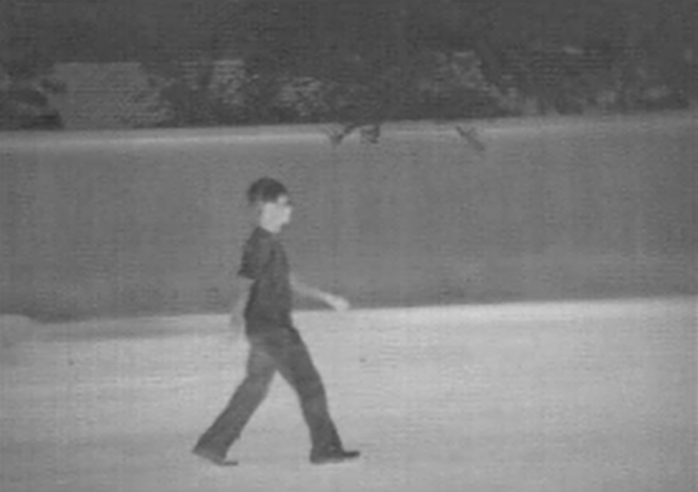
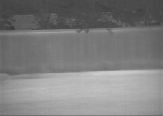
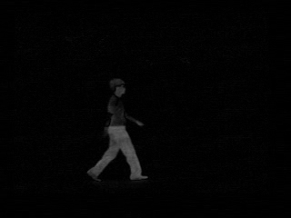
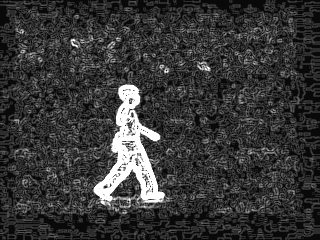
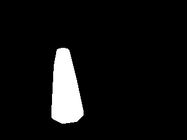
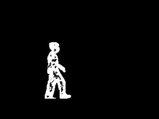
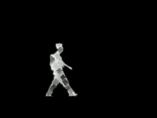
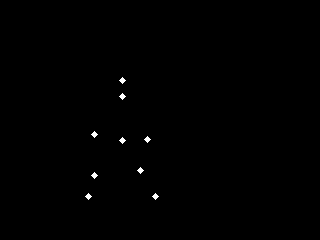
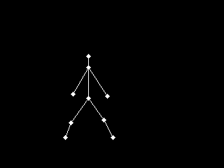

# Infrared Gait Recognition using Point Light Animation and Spatio-Temporal Features

## Algorithm Description
This project is an implementation of a gait recognition system with the CASIA-C dataset using Point Light Data and Spatio-Temporal features for gait representation. Below are the components:
1) Background Subtraction
2) Point Light Data
3) Spatio-Temporal Features & Classification

### 1) Background Subtraction

The initial ROI is obtained by first modelling the background of the gait sequence using a standard intensity-based background median model at each pixel. Once this background model is generated, it is subtracted from the gait sequences to obtain a rough estimate of the silhouette. Given below is an example of the silhouette obtained:

<table>
    <tr>
        <td align = "center" > Original Image </td>
        <td align = "center" > Background Median</td>
        <td align = "center" > Silhouette obtained</td>
    </tr>
    <tr>
        <td></td>
        <td></td>
        <td></td>
    </tr>
 </table>

Sobel edge detectors are used to generate a crude outline of the subject along with gamma correction to improve visibility. The torso and the feet of the human silhouette were pro-
cessed individually and a convex hull was constructed around the largest contour which outlined the foreground object. 

<table>
    <tr>
        <td align = "center"> Final gradients with gamma correction </td>
        <td align = "center"> Convex Hull constructed around the silhouette </td>
        <td align = "center"> Final Silhouette </td>
    </tr>
    <tr>
        <td></td>
        <td></td>
        <td></td>
    </tr>
 </table>

The final silhouette was obtained by a weighted addition of frames with 5 random threshold values (weights starting from 0.5 and decreased by 0.1). Even though the silhouettes are not of a very high quality, they are sufficient to extract the required features.

### 2) Point Light Data

The height of the subject is calculated using the centroid and searching in the vertical directions from the centroid. From the computed total height H, heights of the head (0% of H), neck (13% of H), arms (45-52% of H), knees (73% of H) and feet (93% of H) are estimated.

<table>
    <tr>
        <td align = "center"> Input Frame </td>
        <td align = "center"> Point Lights </td>
        <td align = "center"> Stick figure for visual aid </td>
    </tr>
    <tr>
        <td></td>
        <td></td>
        <td></td>
    </tr>
 </table>

Major distances computed:
1) Front arm from the centroid
2) Rear arm from the centroid
3) Front knee from the centroid
4) Rear knee from the centroid
5) Front foot from the centroid
6) Rear foot from the centroid
7) Front foot and rear foot

Major angles computed:
1) Angle between the front thigh and vertical
2) Angle between the rear thigh and vertical
3) Angle between the front shin and vertical
4) Angle between the rear shin and vertical

### 3) Spatio-Temporal Features & Classification

A single gait cycle is measured from one heel-strike to another of the same leg. The spatial features are obtained by constructing a bounding box around the silhouette. The spatial features are the height, width, angle and aspect ratio of the bounding box.

Temporal features computed:
1) Step Length: Maximum distance between feet during a gait cycle
2) Stride length: Distance travelled by the subject during a gait cycle
3) Cadence: Number of steps per minute
3) Velocity: (1/2) * cadence * stride length

A SVM model was used for classification of the gait signatures. All the above mentioned features are concatenated to give a (1 x 30) feature vector for a single subject.

## Getting Started

### Prerequisites

This project is built on Python 3. It requires OpenCV support and this project was implemented using OpenCV 3.4. The dataset used is the CASIA-C dataset which is available here (http://www.cbsr.ia.ac.cn/english/Gait%20Databases.asp). The training set consisted of the first 7 sequences for each subject and the test set consisted of the remaining 3 sequences per subject.

### Running the Program

To train and test the model:
```python3 src/svm_train.py```

To generate binary silhouettes:
```python3 src/background_subtract.py```

## References
1. D. Das and S. Saharia, “Human gait analysis and recognition using
support vector machines,” International Journal of Computer Science &
Information Technology, vol. 6, no. 5, 2014.

2. D. Tan, K. Huang, S. Yu, and T. Tan, “Efficient night gait recognition
based on template matching,” in 18th International Conference on
Pattern Recognition (ICPR’06), vol. 3, pp. 1000–1003, IEEE, 2006.

3.  L. Sudha and D. R. Bhavani, “Biometric authorization system using gait
biometry,” arXiv preprint arXiv:1108.6294, 2011.

## Contributors
* Ashish Ramayee Asokan
* Chandratop Chakraborty
